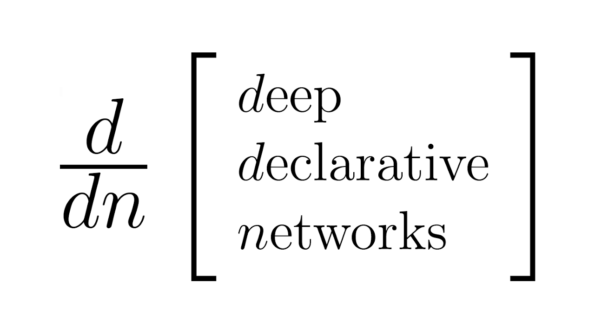

# Deep Declarative Networks

<p align="center"></p>

Deep Declarative Networks (DDNs) are a class of deep learning model that allows for optimization problems
to be embedded within an end-to-end learnable network. This repository maintains code,
[tutorials](https://nbviewer.jupyter.org/github/anucvml/ddn/tree/master/tutorials/) and other
[resources](https://github.com/anucvml/ddn/wiki/Resources) for developing and understanding DDN models.

You can find more details in [this paper](https://ieeexplore.ieee.org/document/9355027) (also [here](https://arxiv.org/abs/1909.04866)),
which if you would like to reference in your research please cite as:

```
@journal{Gould:PAMI2022,
  author      = {Stephen Gould and
                 Richard Hartley and
                 Dylan Campbell},
  title       = {Deep Declarative Networks},
  journal     = {IEEE Transactions on Pattern Analysis and Machine Intelligence}, 
  year        = {2022},
  month       = {Aug},
  volume      = {44},
  pages       = {3988--4004},
  doi         = {10.1109/TPAMI.2021.3059462}
}
```

## Installing

Either clone code from GitHub or install with `pip install "git+https://github.com/anucvml/ddn.git"`.

## Running code

When running code from the command line make sure you add the `ddn` package to your PYTHONPATH. For example:

```
export PYTHONPATH=${PYTHONPATH}:ddn
python tests/testBasicDeclNodes.py
```

Documentation for the `ddn` package is provided in the `ddn` directory (also [here](https://htmlpreview.github.io/?https://github.com/anucvml/ddn/blob/master/docs/ddn/index.html)) and many examples given in the interactive `tutorials`.
These should be opened in Jupyter notebook:

```
cd tutorials
jupyter notebook
```

or viewed using using [jupyter.org's notebook viewer](https://nbviewer.jupyter.org/github/anucvml/ddn/tree/master/tutorials/).

Reference (PyTorch) applications for image and point cloud classification can be found under the `apps`
directory. See the `README` files therein for instructions on installation and how to run.

Documentation can be generated using:
```
pdoc --html --output-dir docs ddn
```

## License

The `ddn` library is distributed under the MIT license. See the [LICENSE](LICENSE) file for details.
